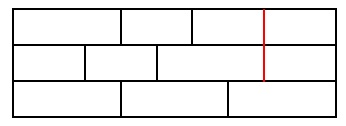

# Práctica 4: Construyendo un muro

## Objetivo
El objetivo de la práctica es aplicar los conceptos básicos sobre programación orientada a objetos en C++ para obtener la solución a un problema que se describirá a continuación.

## Descripción
Considere el problema de construir un muro de dimensiones LxH, donde L representa el ancho (length) del muro (unidades medidas en horizontal) y H representa el alto (height) del muro (unidades medidas verticalmente).

Para construir el muro sólo se pueden utilizar bloques de dimensiones 2x1 y 3x1. También en este caso, las dimensiones de los bloques son dadas en unidades horizontales por unidades verticales, o lo que es lo mismo en: ancho x alto

Puesto que los bloques disponibles tienen ambos altura 1, el muro contendrá siempre H filas de bloques, colocadas una encima de otra.

Para que el muro tenga mayor consistencia y no se derrumbe con facilidad, los laterales de dos bloques adyancentes verticalmente no deben coincidir. Esto significa que el muro no debe existir ninguna línea vertical que atraviese dos filas consecutivas. La única excepción que se permitirá es la de la línea que conforma el lateral o extremo izquierdo del muro y la que conforma el lateral o extremo derecho del muro.

Por ejemplo, en la imagen siguiente se muestra un ejemplo de un muro de dimensiones 9x3. El muro no es válido puesto que entre las últimas dos filas del muro existe una línea vertical que atraviesa dichas filas. Esta línea se representa en rojo en la imagen adjunta.

Ejemplo de un muro no válido

Teniendo en cuenta estas restricciones, existen 8 formas distintas de construir muros válidos de dimensiones 9x3. Esto se denotará formalmente como M(9, 3) = 8.

De forma general, nuestro objetivo será entonces calcular M(L, H), dados un L y H arbitrarios.

## Observaciones

* Para analizar la propuesta desarrollada será necesario hacer pruebas para muros de distintas dimensiones LxH. Habrá que estudiar la eficiencia del programa conforme se aumentan las dimensiones del muro. Será imprescindible saber hasta dónde puede llegar la propuesta que hayamos hecho.

* En relación a la eficiencia del programa, será fundamental la decisión relativa a cómo representar los bloques del muro, su disposición dentro de una determinada fila y la secuencia de filas adyacentes que conformarán el muro. Esta representación será decisiva a la hora de poder afrontar problemas de mayores dimensiones.

* Será interesante analizar en qué medida la representación de soluciones podrá acelerar el cálculo de las posibles soluciones y en qué medida afectaría el hecho de manejar una representación más genérica en la que, por ejemplo, se pudieran manejar bloques de dimensiones arbitrarias o diferentes a las aquí planteadas.

* Por último, se valorará el diseño de clases propuesto así como la gestión realizada con las mismas. Será importante analizar el problema antes de comenzar con la implementación y tomar de antemano una decisión sobre las estructuras de datos que se van a utilizar.

## Notas de implementación
Algunas de las características o funcionalidades básicas que debería tener el programa son las siguientes:

1. Solicitar al usuario las dimensiones del muro (L, H).
1. Calcular y mostrar por pantalla el número de muros distintos que se podrían crear con las dimensiones especificadas. De forma adicional, mostrar también el tiempo empleado en realizar dicho cómputo.
1. Proporcionar una opción que permita al usuario ir visualizando por pantalla cada una de las soluciones encontradas. Es decir, si para el problema de dimensiones 9x3 existen 8 posibles muros, el programa debería mostrar por pantalla cada uno de los ocho muros. Para mostrar un muro por pantalla se deberá seguir la notación siguiente:

|xxx|xx|xx|xx|  
|xx|xx|xxx|xx|  
|xxx|xxx|xxx|

Donde la codificación (en formato texto) anterior representa al muro de la figura de ejemplo (muro no válido para dimensiones 9x3). Es posible que la última división no quede alineada correctamente (la primera fila empezando por abajo solo tiene dos divisiones intermedias, mientras que las siguientes tienen tres, produciendo ese efecto visual). Lo importante es comprobar que dos divisiones intermedias de dos filas consecutivas no estén alineadas.
