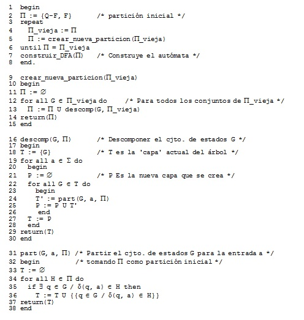

# Práctica #08: Minimización de autómatas finitos deterministas

## Objetivo

El objetivo de esta práctica consiste en implementar el algoritmo que minimice el número de estados de un autómata finito determinista (DFA). Para ello, se tomará como punto de partida el código elaborado en la práctica número 6 para la simulación de un DFA y se incluirá una opción para la minimización de los estados de un DFA previamente especificado.

## Algoritmo de minimización de estados

Sea un autómata Q ≡ (Q, Σ, s, F, δ). Dos estados de un autómata p, q ∈ Q se dicen distinguibles si para alguna cadena x ∈ Σ<sup>*</sup> ocurre que:

δ(p, x) ∈ F    y    δ(q, x) ∉ F,   o viceversa

Si todos los pares de estados del DFA son distinguibles, el autómata no tendrá estados redundantes y, por lo tanto, diremos que es un DFA mínimo. Si el autómata contiene uno o más conjuntos de estados no distinguibles, se puede eliminar la redundancia reemplazando cada conjunto de estados por un único estado.

Para determinar qué conjuntos de estados son no distinguibles se puede aplicar el algoritmo de minimización de estados. Este algoritmo se basa en determinar todos los conjuntos de estados que pueden ser diferenciados por una cadena de entrada. Al finalizar el algoritmo, cada grupo de estados no distinguibles se fusiona entonces en un único estado. El algoritmo trabajará manteniendo y refinando una partición del conjunto de estados. Cada grupo o conjunto de estados dentro de la partición estará formado por estados que aún no han sido distinguidos, mientras que cada uno de los grupos o conjuntos de estados dentro de la partición ha sido considerado "distinguible" (con respecto al resto de grupos) por alguna entrada.

Al comienzo del algoritmo la partición tiene dos conjuntos o grupos de estados: un conjunto con los estados que son de aceptación y otro conjunto con los estados que no son de aceptación. El paso básico del algoritmo consiste en tomar un conjunto de estados ***C = {e<sub>1</sub>, e<sub>2</sub>, ..., e<sub>k</sub>}*** y un símbolo del alfabeto y comprobar qué transiciones producen los estados del conjunto C con esa entrada. Si estas transiciones son hacia estados de dos o más conjuntos distintos de la partición considerada, entonces el conjunto C ha de dividirse para que las transiciones desde los subconjuntos de C queden todas restringidas en un único conjunto de la partición que se está considerando. Supongamos, por ejemplo, que los estados e<sub>1</sub> y e<sub>2</sub> transitan a los estados t<sub>1</sub> y t<sub>2</sub> con un determinado símbolo de entrada, a, y que t<sub>1</sub> y t<sub>2</sub> están en diferentes conjuntos de la partición actual. En este caso, habrá que dividir el conjunto C en al menos dos subconjuntos para conseguir que el estado e<sub>1</sub> y el estado e<sub>2</sub> estén en subconjuntos distintos pues tienen comportamientos diferentes.

Este proceso de división de los conjuntos de estados se repetirá hasta que ya no puedan realizarse más subdivisiones de conjuntos de estados. Un pseudocódigo de este algoritmo, estructurado en varios procedimientos se presenta a continuación:




## Funcionamiento general del programa

El programa principal debería ofrecer al usuario las funcionalidades siguientes:

* **Leer DFA:** al seleccionar esta opción se deberá solicitar al usuario que introduzca el nombre del fichero donde se encuentra la especificación del autómata. Tras la inicialización del DFA habrá que notificar al usuario si se produce algún error en la creación del automáta. El programa deberá detectar que no haya ningún error en la definición del autómata. Esto es, habría que analizar que se cumplen las siguientes condiciones:
  * Existe uno y sólo un estado inicial para el autómata.
  * Hay una línea en el fichero por cada uno de los estados que tiene el autómata.
  * Para cada estado del autómata siempre existe una y sólo una transición para cada uno de los símbolos del alfabeto.

* **Mostrar DFA:** al seleccionar esta opción se mostrará por pantalla el autómata actualmente definido (previamente leído de fichero) en nuestro programa. Para mostrar el autómata por pantalla se seguirá el formato establecido para los ficheros *.dfa*.

* **Identificar estados de muerte:** al seleccionar esta opción se deberá mostrar por pantalla si el autómata previamente definido tiene estados de muerte y si es así, habrá que indicar cuáles son los identificadores de dichos estados de muerte.

* **Analizar cadena:** al seleccionar esta opción se deberá solicitar al usuario que introduzca una cadena. Para la cadena indicada por el usuario se deberá determinar si es aceptada o no por el autómata actualmente definido. Al igual que ocurre con las dos opciones anteriores, esta opción tampoco se podrá ejecutar si no se ha inicializado previamente un autómata. El formato de la traza a mostrar por pantalla será el siguiente:

    ```  
    Cadena de entrada: ___________  
    Estado actual    Entrada    Siguiente estado  
    X                Y          Z  
    X                Y          Z  
    X                Y          Z  
    Cadena de entrada ACEPTADA / NO ACEPTADA  
    ```

    Tal y como se indica en las líneas anteriores, en primer lugar se deberá mostrar la cadena de entrada. A continuación se indicará cómo va transitando de un estado a otro el autómata según va leyendo la cadena de entrada y finalmente, se deberá mostrar el mensaje *“Cadena de entrada ACEPTADA”* si la cadena de entrada es aceptada por el DFA o el mensaje *“Cadena de entrada NO ACEPTADA”* si la cadena de entrada no es aceptada por el DFA.

* **Minimizar DFA:** al seleccionar esta opción se aplicará al DFA actualmente definido, el algoritmo de minimización de estados. Al aplicar este algoritmo se deberá mostrar una traza en la que se indique paso a paso qué subdivisiones de conjuntos se van haciendo y con respecto a qué símbolo del alfabeto se hace dicha división. La traza tendrá un formato similar al siguiente:

    ```
    P0 = {{0, 1, 2, 3}, {4}}

    Con el símbolo 'a':
    P1 = {{0, 1, 2, 3}, {4}}

    Con el símbolo 'b':
    P2 = {{0, 2}, {1, 3}, {4}}

    ...

    Con el símbolo 'a':
    Pk = {{0, 2}, {1}, {3}, {4}}

    Con el símbolo 'b': 
    Pk+1 = {{0, 2}, {1}, {3}, {4}}

    El DFA mínimo tiene cuatro estados.
    ```

    Tras aplicar el algoritmo de minimización de estados el DFA actual en nuestro programa pasa a ser el DFA mínimo que se haya obtenido. De esta forma, las opciones del menú que se apliquen, por ejemplo, mostrar el DFA o exportarlo se llevarán a cabo sobre la versión mínima del DFA. Al crear el nuevo DFA (versión mínima del DFA definido) será conveniente enumerar los estados en orden ascendente, **del cero en adelante y de forma consecutiva.**

* **Exportar DFA:** mediante esta opción se podrá exportar a un fichero *.dfa* el DFA actualmente definido en el programa. El formato a utilizar será el que se ha definido para los ficheros *.dfa*.

## Detalles de implementación

* Para la implementación de esta práctica es conveniente partir del código desarrollado en la práctica número 6 donde se simularon autómatas finitos deterministas.
* Se deberá añadir a la clase "DFA" un método "minimize" que obtenga el DFA mínimo equivalente. 
* Se deberá modificar el código existente para permitir que además de mostrar por pantalla un DFA existente, también se pueda exportar la especificación del mismo a un fichero *.dfa*.
* Se requerirá el [uso de Makefiles](http://stackoverflow.com/questions/2481269/how-to-make-simple-c-makefile) para compilar los códigos.
* Documentación: se requerirá un mínimo de documentación para los códigos desarrollados, por lo menos documentar las cabeceras de las clases y los métodos más importantes. Vean referencias en estos Tips para documentar códigos utilizando [Doxygen](http://www.stack.nl/~dimitri/doxygen/)
* Documentación: definir un [fichero de configuración de doxygen](http://codeyarns.com/2014/06/18/how-to-configure-doxygen-for-c-code/) para generar la documentación en html.